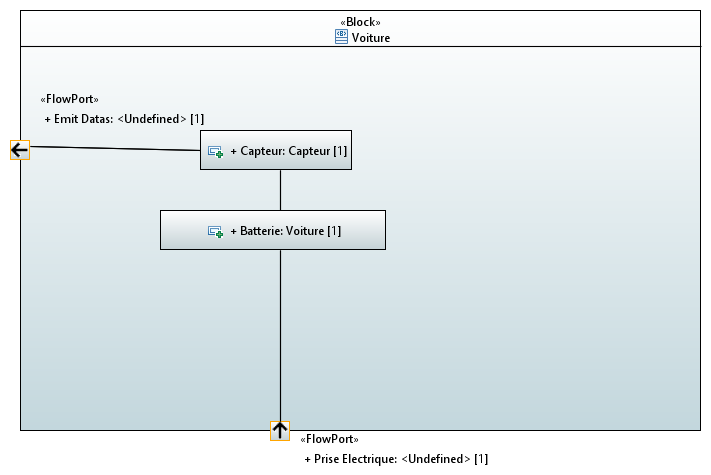
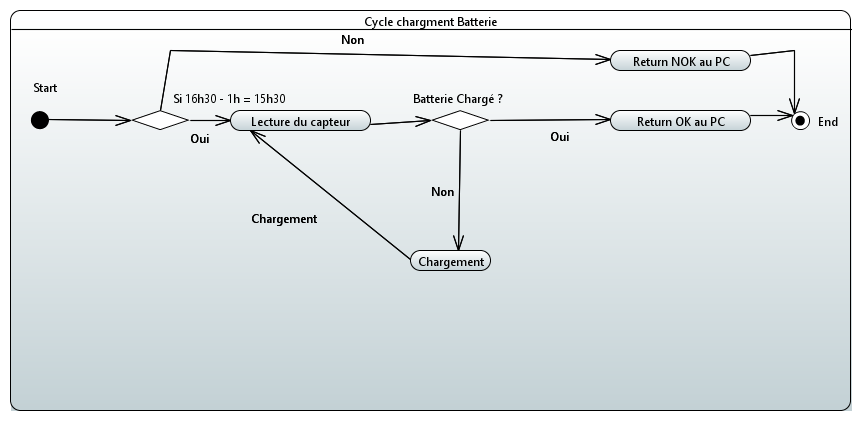

Groupe Model : GLORIES Ancelin  CESCHIN Quentin

# RequirementEngineeringExperimentations

Dans ce read me vous trouverez les différents diagrammes modélisant les exigences de ce projet.

## Le digramme des cas d'utilisations

### Définition des acteurs : 

Par rapport aux exigences, nous allons ajouter un scénario d'utilisation : l'utlisateur souhaite se déplacer en voiture tous les jours à 16h30.
On souhaite mesurer différentes grandeurs afin de pouvoir afficher à l'utilisateur l'état de santé de sa maison. La maison va devoir synthètiser une conclusion compréhensible pour un humain à partir des données mesurées et les rendres visibles pour l'utilisateur.

## Le diagramme de définition de blocs

Une maison va posseder plusieurs capteurs qui s'occuperont de mesurer les différentes grandeurs. Il en va de même pour la voiture. De cette façon, ces deux derniers n'ont pas s'occuper des messures.
Ainsi on peut attacher une liste de capteurs avec un ou plusieurs poste de contrôle (si utilisation d'un événement sur un bus de communication).

On aurait pu ajouter une batterie à la voiture, mais cela reste du détails pour le fonctionnement global, il n'y a donc pas d'obligation sur ça présence. De plus le capteur le voiture, permet de la représenter indirectement.

## Le diagramme de blocs internes 

## Le diagramme dynamique : Diagrame Machine à état

Nous allons supposer que la voiture met 1h à charger (il faudrait les specs de la voitures pour utiliser le bon temps)

Lors qu'il sera 16h30 - 1h soit 15h30 (ainsi on est sur d'avoir le temps de recharger totalement ou partiellement la batterie) , nous interrogeons le capteur de charge de la voiture afin de déterminer s'il faut recharger la voiture.
* Si oui, on lance alors la charge pour une petite pèriode puis on reboucle sur l'évaluation du capteur.
* Si non, la voiture est préte, le capteur va notifier l'unité centrale afin d'indiquer que la voiture est chargée.

